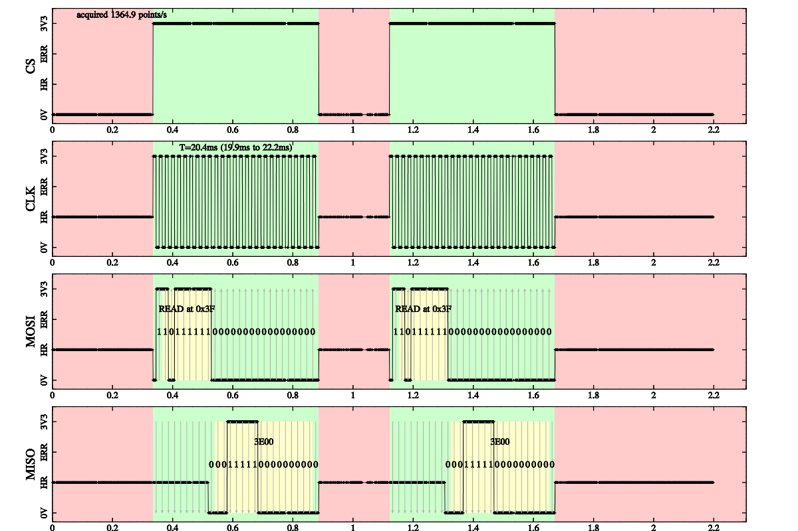

Guide for Logic Analyzer RPi
==============

I)Example of output 
==============

Image obtained during two consecutive read instructions on a NMC9314 EEPROM memory using following command:

	make test

You must have installed [NMC9314 Pi](https://github.com/superzerg/NMC9314_pi) first.

II) Dependence 
==============
It use the C library for Raspberry Pi [http://www.open.com.au/mikem/bcm2835](http://www.open.com.au/mikem/bcm2835/index.html)

III) Disclaimer
===============
This program has been made for personal use, it works for me, but I offer no warranty as this program may (unlikely) damage your raspberry pi, your memory and/or any electronic device connected. Use it at your own risk.

IV) Connection
===============

If you have to make measurement on a 5V circuit, this is a way to avoid toasting your GPIO.

	RASPBERRY PI              74F126N
	 ______________       ________________________
	|              |     |                       |
	|              |  /--|3Y (pin 5)   3A (pin 6)|<--- INPUT
	|              |  |  |_______________________|
	|              | | | 
	|              | |R|
	|              | |1|
	|              | |_|
	|              |  | 
	|         GPIOi|<-|
	|______________|  |
	                 | |
	                 |R|
	                 |2|
	                 |_|
	                  |
	                 GND 
	R1=32 kohms
	R2=68 kohms

On a 3V3 circuit you can connect direclty your input to the GPIO pin.
As the GPIO pins number orderring is at least confusing, you can print the following image corrsponding to your RPi version. 
Then apply it on GPIO pins (from http://www.doctormonk.com/2013/02/raspberry-pi-and-breadboard-raspberry.html).
PDF files are also availble there for easier printing.

The numbers next to the GPIO pins used to acquire data are the one to use in [pins](http://superzerg.github.com/logic-analyzer/classlogic__input.html#a691df164430ee863f12e0aaaeb7510a7) array.
The order matter, for exemple with the microwire protocol:
- pins[0] acquires CS (Chip Select) of the studied device.
- pins[1] acquires CLK (clock) of the studied device.
- pins[2] acquires MOSI (Master Out Slave In) of the studied device.
- pins[3] acquires MISO (Master In Slave Out) of the studied device.

V) Usage
===============

No arguments can yet be passed to the main program, so you will have to edit logic_analyzer.cpp:
1) Edit the pins array according to indications in [IV Connection](#iv-connection) eg.

	#include <mgl/mgl_zb.h>
	#include "microwire.h"
	
	int main(int argc, char **argv)
	{
		uint8_t pins[4]={15,14,4,27};
	
2) Use the right protocol eg.

		microwire test(pins,4);
	
3) The default is to create a PNG image, it is done as follow :

		mglGraphZB gr(1200,800);
		test.Draw(&gr);
		gr->WritePNG("filename.png");
	}
	
It is also possible to Draw into a windows or a widget, see the mathgl documentation.

VI) Install
===============
1. install the C library for Raspberry Pi (http://www.open.com.au/mikem/bcm2835/index.html)
2. get the Logic Analyzer RPi files at https://github.com/superzerg/logic-analyzer
3. compile with:
	make

VII) More Information
===============
More information is available with the developer's guide (http://superzerg.github.com/logic-analyzer/index.html)

VIII) License
===============
Copyright (C) 1994, 1995, 1996, 1999, 2000, 2001, 2002, 2004, 2005,
2006, 2007, 2008, 2009 Free Software Foundation, Inc.

   Copying and distribution of this file, with or without modification,
are permitted in any medium without royalty provided the copyright
notice and this notice are preserved.  This file is offered as-is,
without warranty of any kind.

